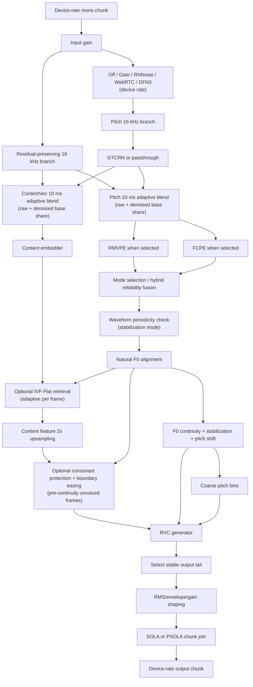

# Architecture

## Purpose

This document describes the conceptual architecture of `vc-rs`: how audio moves
through the realtime engine, how the RVC pipeline is staged, and why chunk
smoothing is separated from the audio callback. Concrete commands, local model
paths, and smoke-test recipes belong in `README.md` or local scripts instead.

CLI, GUI, VST3, and WAV conversion share the same audio-I/O-agnostic conversion
components wherever their hosting constraints permit. Front-ends adapt device,
host, or file I/O to those components; they should not own separate inference,
chunk-conversion, smoothing, or output-assembly implementations.

## Module Boundaries

- `vc-core`: shared audio-I/O-agnostic conversion components, including
  `RvcPipeline`, `ChunkConverter`, DSP, and SOLA/PSOLA smoothing.
- `vc-app`: shared standalone realtime runtime for CLI and GUI, including device
  I/O, bounded queues, worker orchestration, and metrics. The audio host is the
  `AudioHost` enum (cpal-`HostId`-aligned: `Wasapi`/`Asio`/`CoreAudio`/`Alsa`/`Jack`)
  and is chosen **per direction** (`input_host`/`output_host` in `RealtimeConfig`),
  so input and output may use different hosts — they are independent streams and
  clock domains, already resampled between by the engine. Every host except WASAPI
  *exclusive* goes through the shared cpal stream path (they differ only by which
  cpal host the device comes from); WASAPI exclusive uses the bespoke `wasapi_audio`
  path until cpal gains exclusive mode. Hosts unavailable on the running
  platform/build (e.g. ASIO without the `asio` feature) error at open time. cpal
  loads a single ASIO driver globally, so ASIO-on-both-directions shares one driver.
- `vc-cli`: CLI arguments, validation, realtime runtime control, and WAV file
  adaptation to the shared conversion components.
- `vc-gui`: GUI state and controls that configure the `vc-app` runtime.
- `vc-vst3`: DAW host adaptation, audio-callback ring-buffer I/O, worker
  scheduling, plugin state, and host latency reporting.

Changes to chunk sizing, model context, smoothing, or output latency usually
cross the front-end worker runtimes, `model_rvc`, `sola`, and `dsp`; review them
together.

## Shared Conversion Paths

All conversion modes should use the shared `vc-core` model and chunk-conversion
components. Inference, model streaming state, output shaping, and SOLA/PSOLA
joining must not be reimplemented in a front-end merely because its audio source
or scheduler differs.

CLI and GUI additionally share `vc-app` because both own standalone audio
devices. VST3 cannot use that device runtime because the DAW owns its audio
callback and requires plugin-specific state and latency reporting. VST3 should
still adapt host audio to the shared conversion components and keep its distinct
worker and buffering behavior narrowly scoped to host integration.

WAV conversion is an offline adapter around the same `RvcPipeline` and
`ChunkConverter` path used for realtime conversion. Offline processing may use
different scheduling, prime the smoother, pad a partial input chunk, and collect
the final tail explicitly. Those differences must not become a separate model,
chunk-conversion, smoothing, or output-shaping path.

When a hosting constraint requires a front-end-specific behavior, document the
constraint near the implementation and preserve the shared path for all
unaffected stages.

## Realtime Topology

```mermaid
flowchart LR
    mic["Input device"] --> in_cb["Input audio callback"]
    in_cb --> in_ring["Input ring buffer"]
    in_ring --> worker["Worker thread"]
    worker --> model["RVC pipeline"]
    model --> smooth["SOLA / PSOLA smoother"]
    smooth --> out_ring["Output ring buffer"]
    out_ring --> out_cb["Output audio callback"]
    out_cb --> speaker["Output device"]
```

The audio callbacks are intentionally small. They move samples through bounded
ring buffers and emit silence on underrun; they do not run ONNX inference,
perform chunk smoothing, write files, or log directly. Anything that can block,
allocate heavily, or take model-scale CPU/GPU time is kept on the worker side.

The threads carrying those callbacks run at OS real-time priority. The bespoke
WASAPI path and the worker self-boost via `thread-priority`; the cpal-driven
paths (WASAPI-shared, ASIO, …) get the same treatment from cpal's `realtime`
feature (enabled on the `cpal` dependency in `vc-app`), which promotes its
internal stream threads — Windows MMCSS "Pro Audio", else
`THREAD_PRIORITY_TIME_CRITICAL`. This pulls `audio_thread_priority` (MPL-2.0),
allowed crate-scoped in `deny.toml` since it ships unmodified and statically
linked.

The worker owns chunk accumulation, model inference, output smoothing,
resampling back to the device rate, and metrics updates. If inference falls
behind, bounded queues make the failure mode explicit: input overrun drops new
input samples, output underrun emits silence, and output overflow drops newly
produced samples rather than blocking the realtime callback.

Standalone sessions with a complete model set keep both RVC and passthrough
routes available on the worker. The live passthrough flag is sampled once per
input chunk. Passthrough stops invoking RVC inference and applies input gain,
the configured input denoiser, device-rate resampling, and output gain. When
conversion resumes, the worker clears stale RVC rolling context and smoother
history before processing the next chunk. Model-free sessions expose only the
passthrough route.

## Chunk Lifecycle

Realtime audio arrives in device callback-sized blocks, but the model operates
on larger logical chunks. The worker accumulates input samples until one model
chunk is available, then sends that chunk through the RVC pipeline.

The RVC pipeline does not treat each chunk as isolated audio. It keeps streaming
state for recent input, 16 kHz resampled audio, content features, and F0 frames.
Each inference window includes the current chunk plus enough recent context and
extra output allowance for smoothing. The model output is then trimmed to the
tail that corresponds to the current chunk and the smoother search window.

This lifecycle preserves three invariants:

- The output smoother emits a fixed number of device-rate samples per input
  chunk.
- Feature frames, continuous F0, coarse pitch, and model output must refer to
  the same time window.
- The realtime callback sees only queued samples, never model-domain state.

## RVC Pipeline

Standalone RNNoise (48 kHz) runs at the **device rate**, after input gain and on
the RMVPE branch. Its fixed-delay adapter preserves the input sample count for
every worker call while retaining recurrent and resampler state across chunks.
The residual ContentVec branch remains unprocessed except for a matching delay,
then receives the configured denoised share after both branches reach 16 kHz.

**GTCRN (16 kHz) is the exception to the device-rate rule.** It denoises the new
16 kHz increment *inside* `generate_input` — reusing the resample the pipeline
already does into `audio_16k_buffer`, before that increment is windowed — so the
realtime hot path pays no extra round-trip resample and the model sees native
16 kHz. It shares the same fixed-delay `FrameDenoiser` adapter as RNNoise (at
16 kHz the adapter's resamplers are bypass), preserves the per-call 16 kHz sample
count, and never shifts the feature/F0 grid. RVC-path **input RMS and silence
detection use the configured RMVPE branch**, while volume-envelope memory and
the RMS-mix reference follow the residual-preserving ContentVec blend. With
denoising off, both histories are filled from one 16 kHz resample; a second
resampler is used only when the device-rate branches differ. The passthrough
route keeps a separate device-rate GTCRN instance (its resamplers engage). GTCRN
ships in standalone packages: Windows ML uses ORT CPU for the tiny graph, while
TensorRT uses a native TensorRT engine so the TensorRT package remains ORT-free.
VST3 enables the in-tree WebRTC suppressor, but intentionally does not enable
or ship RNNoise, GTCRN, or DeepFilterNet3 model data. `package.ps1 -DeepFilterNet3`
is an external-model opt-in package variant: it includes DFN3 runtime code and
matching license notices, but never the model archive.

For Gate, RNNoise, WebRTC, GTCRN, and DeepFilterNet3, `denoiser_content_mix` and
`denoiser_rmvpe_mix` are live worker-side base controls. For ContentVec, `0`
sends raw input and `0.25` is the residual-preserving default. RMVPE uses the
same `0..=1` scale and defaults to `1.0`. Every new aligned 16 kHz increment is
analysed in 10 ms frames before either branch is mixed. An energy rise confirmed
by denoiser residual and zero-crossing/first-difference shape can quickly lower
the ContentVec denoised share, retaining a plosive or fricative that the denoiser
removed. The RMVPE reduction is deliberately much smaller and limited to
low-zero-crossing voiced onsets, because raw fricative noise is not useful pitch
evidence. Per-sample one-pole envelopes attack in about 2 ms and recover in about
52 ms, so frame decisions cannot create a discontinuity. A stationary room-noise
frame has no continuing energy rise and returns to the configured base instead
of holding the raw path open.

RNNoise and GTCRN have fixed output delay, so both raw branches pass through
matching preallocated alignment before analysis and mixing; this prevents an
earlier voice from being combined with the cleaned signal. The detector carries
only scalar state, resets with the model timeline, and processes each new sample
once. All analysis, branch buffers, resampling, and denoiser work stay on the
conversion worker; callbacks continue to move samples only through lock-free
queues.

The optional **silence suppressor** is downstream of conversion and separate
from the exclusive input denoiser choice. Its worker-owned adaptive activity
detector observes the newest 16 kHz RMVPE branch and fuses a streaming Silero
neural VAD result with an acoustic fallback: learned stationary RMS floor,
energy above that floor, zero-crossing shape, and pre-continuity F0 evidence. The
configured/calibrated threshold is a minimum reference for opening the gate.
Raw F0 never opens it by itself, because RMVPE can assign pitch to fan hum,
mains noise, or music bleed; low neural confidence can veto that weak pitch
path, while energy/transient evidence remains available for unvoiced consonants
and word starts. A stationary/periodic signal also needs a larger energy margin
than modulated speech. The detector is worker-owned and runs only while the
suppressor is enabled; it is neither ASR nor a language classifier.

After two inactive chunks, generated output passes through a shared cross-chunk
envelope rather than being hard-zeroed: it closes over 50 ms and reopens over
8 ms. Inference, rolling ContentVec/F0 state, and denoiser state still advance
during muting. A startup grace period and 180 ms speech hangover preserve initial
syllables and short pauses while preventing a steady idle room noise from being
re-synthesized. The detector and envelope reset with the model stream, input
branch, and device-rate timeline, and never run in an audio callback. Dynamic
tuning latches an automatically enabled suppressor for the current mode/session,
so SNR fluctuations cannot repeatedly reset the detector.

The standalone realtime runtime also has an optional worker-owned dynamic
tuner. It starts from the front-end's atomic `LiveParams` snapshot, applies a
bounded overlay only before the next conversion chunk, and then updates that
overlay from raw input RMS/zero-crossing observations plus the completed
chunk's voiced ratio and F0 variation. `Auto` is deliberately a conservative
acoustic profile heuristic rather than ASR or text-level language ID: it remains
neutral unless one candidate stays high-confidence for eight chunks. Fixed
Chinese, English, and Japanese profiles bypass that classification. Publishing
its small diagnostic snapshot uses a best-effort worker `try_lock`; audio
callbacks do not observe or lock it. Chunk sizing, extra context, model paths,
and denoiser topology remain reload-scoped because changing them would rebuild
streaming state and can make an audible discontinuity.

Changing denoiser mode restarts its model-side rolling windows and matching
delay lines, and the owning front-end discards the SOLA/PSOLA join history at the
same boundary. This prevents pre-switch audio from being concatenated or
crossfaded with a differently delayed post-switch timeline.

Conceptually, RVC conversion has three model-facing inputs:

- Content features describe what is being spoken while discarding much of the
  source speaker identity.
- F0/pitch describes the melody of voiced speech and supports pitch shifting.
- Speaker/model conditioning selects the target voice inside the RVC model.

The content embedder and F0 estimator operate on the same 16 kHz context window.
Content features are upsampled by repeating each frame twice, matching the RVC
pipeline convention that expands the content-feature frame rate before
generation. F0 is then length-matched to the resulting feature frame count and
kept both as continuous `pitchf` and quantized coarse pitch. Misaligning these
streams usually sounds like timing drift, pitch lag, or unstable consonants, so
frame-grid changes should be treated as audio-quality changes, not cleanup.

The default F0 path is RMVPE. `F0Mode::Fcpe` instead loads only an external FCPE
ONNX model; it does not require, inspect, build, or run RMVPE. `F0Mode::Hybrid`
loads both on the same worker-owned 16 kHz window. FCPE's `[1, samples, 1]`
input and `[1, frames, 1]` output are checked at load time and normalized onto
the shared 10 ms grid. In Hybrid mode agreement is averaged in log-Hz;
disagreements use waveform periodicity and short-term contour continuity, with
the FCPE right-edge frames treated conservatively because that model has less
future context there. This is a reliability fusion, not a claim that FCPE's
thresholded output is a calibrated confidence probability.

For CUDA/TensorRT fixed-shape providers, each selected F0 session is specialized
to the same audio window. Each derived window length owns a separate profile,
engine, fixed IoBinding, and (where enabled) CUDA Graph. A dynamic FCPE ONNX may
therefore be reused to build engines for several lengths, but no engine is
resized and no profile/shape or memory is rebuilt in the realtime callback.
Missing or incompatible mode-specific paths fail during configuration/load,
before the worker starts processing audio. Model files remain external
user-owned assets and are never embedded in a distribution.

When configured, the pipeline reads a standard RVC
`added_IVF*_Flat_*.index` FAISS `IndexIVFFlat` file during model construction.
It rejects unsupported index families, unpopulated `trained_*.index` files, and
feature widths that do not match the generator (v1 = 256, v2 = 768). The worker
searches its reusable IVF scratch buffers for the eight nearest vectors and
applies the configured `index_rate` as a base rate, then scales it per frame
using nearest-vector confidence, natural-F0 voicing, natural-F0 temporal
reliability, and ContentVec/F0 boundary evidence. With stabilization enabled,
the natural voiced/unvoiced mask has already passed the waveform-periodicity
check described below. The reliability value is still a proxy derived from F0
support and pitch continuity, not an RMVPE posterior
probability or confidence output. Boundary evidence uses Schmitt-style
hysteresis, while the effective Index and Protect scales fall quickly when
evidence weakens and recover more slowly across adjacent frames. Strong, stable
voiced matches therefore retain the target timbre; weak matches and sharp
consonant or voicing transitions keep more of the source content.

These control states are reconstructed deterministically from every rolling
context window. They are not carried forward as a terminal cross-chunk EMA,
because realtime windows replay an overlapping historical prefix and doing so
would advance the same old frames twice. `index_rate=0` remains an exact no-op.
If `protect < 0.5`, the worker also retains the pre-retrieval ContentVec tensor
and, after the same trim/repeat transformation, mixes it back on pre-continuity unvoiced
frames using the corresponding adaptive scale. It intentionally uses natural,
pre-continuity and unshifted F0 so later interpolation/pitch shifting cannot turn a consonant
into a retrieval-voiced frame. Index file I/O, parsing, retrieval, adaptive
smoothing, and scratch memory all remain in the shared conversion worker,
outside every device or DAW audio callback.

`protect_transition_ms` is a vc-rs extension, not an MXGF/upstream-RVC setting.
At its default of zero it takes the exact binary upstream Protect path. A
positive value is rounded up to the 10 ms generator feature grid and blends the
nearby *voiced* frames progressively from the Protect mix back to full retrieval;
the pre-continuity unvoiced frame itself remains protected. The bounded 0..100 ms scan
uses the existing worker-owned tensors and no extra scratch allocation. It is
skipped entirely without an index, with `index_rate=0`, or with `protect=0.5`.

The default RMVPE confidence threshold is 0.03. With F0 stabilization enabled,
each thresholded voiced frame is first checked against normalized waveform
autocorrelation near its expected period in the exact 16 kHz RMVPE window. Only
strongly contradicted frames are cleared; insufficient edge context and middling
periodicity retain RMVPE's decision. This filters aperiodic room-noise pitch
without pretending to expose an RMVPE posterior, and the corrected natural mask
is shared by speech activity, adaptive retrieval, Protect, and synthesis.

Optional F0 continuity then runs after alignment on the worker. One/two-frame
dropouts are repaired with log-F0 interpolation. Three-to-five-frame gaps are
filled only when two voiced frames on each side are locally stable and the two
bounds remain within three semitones. Gaps over 50 ms, unstable bounds, and
leading/trailing runs stay unvoiced; this prevents a later vowel in a long rolling
window from voicing a pause, breath, or clear consonant. Stabilization also
removes isolated voiced islands, repairs isolated/trailing near-octave mistakes,
and applies a three-frame voiced median only when both neighbors agree. Coarse
pitch is derived from the resulting F0 so the generator inputs remain consistent.

Some RVC exports expose the VITS latent `rnd` tensor as an input with layout
`[1, channels, frames]`. The shared pipeline assigns this noise on the absolute
10 ms generator timeline, keyed by seed, channel, and frame. When a rolling
window replays historical features, those features therefore receive exactly
the same latent values even though their local tensor indices moved. ORT CPU,
ORT IoBinding, TensorRT CUDA Graph, and native TensorRT all use the same Rust
counter-based Gaussian generator. Only the reusable staging buffer differs by
backend. The timeline follows newly appended feature frames, handles changing
offline tail-window lengths, and resets with every model-stream restart. Models
without an exported `rnd` input keep their original inference contract.

After generation, the output may be shaped by volume envelope, RMS mixing, and
manual or automatic gain. These operations happen before chunk joining so the
smoother compares and crossfades audio at the level that will actually be
played.

## SOLA

SOLA, Similarity Overlap-Add, is used to hide discontinuities between
independently generated chunks. Even when two chunks represent adjacent input
audio, the generated waveform can be shifted by a few samples at the boundary.
Naively concatenating those chunks can produce clicks, combing, or a rough
phasiness.

The smoother keeps a short tail from the previous emitted chunk as a reference.
For the next generated candidate, the worker asks the model for extra samples
around the boundary. SOLA searches within that extra range for the offset whose
overlap is most similar to the reference, cuts the candidate at that offset, and
crossfades the overlap. The emitted chunk length stays fixed; only the boundary
position inside the candidate moves.

SOLA must stay on the worker side. It needs model-output history, extra model
samples, correlation search, and crossfade buffers. Moving it into the audio
callback would put search work and allocation pressure on the realtime path.

## PSOLA

PSOLA, Pitch-Synchronous Overlap-Add, is the pitch-aware variant used here when
the current output has stable voiced F0. Instead of accepting any high-similarity
offset, it estimates the current pitch period from `pitchf` and prefers offsets
that align the overlap near pitch-period boundaries.

This is useful for sustained vowels and other voiced regions, where a boundary
that cuts across the waveform period can sound unstable even if the generic
SOLA score is acceptable. When F0 is missing, unvoiced, too unstable, or outside
the supported range, PSOLA falls back to normal SOLA. That fallback is important:
forcing pitch-synchronous alignment on noisy consonants or silence usually makes
the boundary worse.

## Latency Trade-offs

End-to-end latency is the sum of device buffering, input chunk accumulation,
model inference time, smoothing/search allowance, output buffering, and any
resampling delay. Reducing one term often increases pressure elsewhere.

Smaller chunks reduce chunking latency but increase scheduling overhead and make
the model pipeline more sensitive to inference spikes. Larger chunks are easier
for the model and smoother but add startup and interactive latency. Extra model
output gives SOLA/PSOLA more room to find a clean join, but it also increases
the amount of audio processed per chunk.

The architecture therefore treats latency-sensitive code as a boundary:
callbacks are realtime-safe sample movers, while the worker is the only place
that may spend time on inference, smoothing, diagnostics, and file-oriented
debug output.

## WAV Mode

WAV conversion uses the shared `RvcPipeline`, `ChunkConverter`, and smoother so
audio-quality changes can be tested deterministically without device scheduling
noise. It can prime the smoother, pad the final partial input chunk, and handle
the final output tail explicitly because it is not constrained by callback
deadlines. A difference between WAV and realtime output should be explained by
buffering, scheduling, padding, or final-tail handling rather than by a separate
conversion path.
